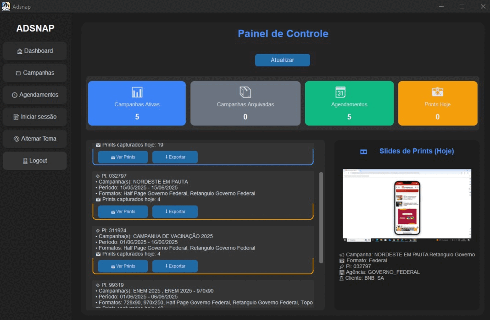

  

<h1 align="center">

</h1>

<h1 align="center">🎯 Lucas.py | Automação Profissional com Python</h1>

  <i>"Transformando tarefas repetitivas em processos inteligentes e automáticos."</i>

  
  
  
  
  
  

---

## 🚀 Projeto em Destaque: **Adsnap**

**Adsnap** é uma ferramenta de automação desenvolvida de forma independente para otimizar rotinas como publisher de campanhas web.  
Seu principal objetivo é realizar **checkings de prints diários** de campanhas publicitárias de forma automatizada.

> A ferramenta foi criada como uma solução pessoal para agilizar e padronizar processos internos de verificação, como a coleta automática de screenshots de banners veiculados pelo **Google Ad Manager**.  
> Todo o desenvolvimento foi conduzido com foco em produtividade e qualidade nos entregáveis da rotina profissional.

### 🎥 Demonstração da Interface

  

---

### 🔧 Tecnologias utilizadas

- Python (núcleo do projeto)  
- Selenium WebDriver (navegação e controle do browser)  
- PyAutoGUI (interação com elementos fora do DOM)  
- Pillow (edição de imagem e screenshots)  
- CustomTkinter (interface gráfica)  
- SQLite (banco de dados local)  
- JavaScript (injeção direta no DOM)

---

### ⚙️ Funcionalidades principais

- Coleta automatizada de prints dos banners veiculados  
- Execução de disparos automáticos com agendamento  
- Interface intuitiva para cadastro e consulta de campanhas  
- Extração de estatísticas via Google Ad Manager *(em desenvolvimento)*  
- Organização de dados por cliente, PI, formato, data e hora  

---

## 🛠️ Skills Técnicas

| Área                     | Tecnologias/Métodos                                               |
|-------------------------|-------------------------------------------------------------------|
| **Backend**             | Python, Django, Jinja2                                            |
| **Automação Web**       | Selenium, PyAutoGUI, JavaScript Injection, Pillow                 |
| **Dados & Relatórios**  | Pandas, SQLite3, Google Analytics                                 |
| **Nuvem & Infraestrutura** | Google Cloud Platform, Google Ad Manager                      |
| **Interface Gráfica**   | CustomTkinter, Tkinter                                            |

---

  
  

## 📬 Contato

- 💼 **LinkedIn:** https://www.linkedin.com/in/lucas-mendonça-1296412b8  
- 🧠 **GitHub:** https://github.com/llucaspy  
- 📫 **Email:** lm.mdpaim@gmail.com  

---

<i>“Menos cliques, mais resultados.”</i>

