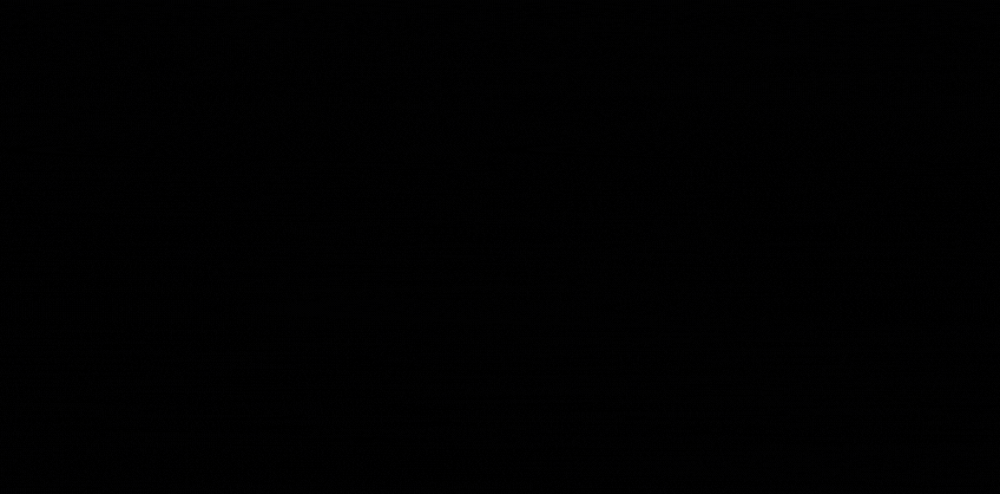

  

<h1 align="center">

</h1>

<h1 align="center"> Lucas.py | Automação Profissional</h1>

  <i>"Transformando tarefas repetitivas em processos inteligentes e automáticos."</i>

  
  
  
  
  
  

---

## 🚀 Projeto em Destaque: **Adsnap V2 PRO**

**Adsnap V2 PRO** é uma ferramenta de automação desenvolvida de forma independente para otimizar minhas rotinas como publisher de campanhas web.  
Seu principal objetivo é realizar **checkings de prints diários** de campanhas publicitárias de forma automatizada.

> A ferramenta foi desenvolvida por iniciativa própria como um projeto independente, com o objetivo de automatizar a coleta de screenshots de banners veiculados e implementados por mim no Google Ad Manager.
> Todo o desenvolvimento — concepção, arquitetura, implementação e testes — foi realizado exclusivamente por mim, sem participação, direcionamento ou recursos de outrem.

### 🎥 Demonstração da Interface

  

---

### 🔧 Tecnologias Utilizadas

- **Next.js 15** (App Router + Turbopack)
- **React 19** (Interface reativa e componentizada)
- **TypeScript** (Tipagem estática em todo o projeto)
- **Prisma ORM** (Modelagem e acesso ao banco de dados)
- **SQLite** (Banco de dados local, leve e portátil)
- **Puppeteer** (Navegação headless e captura de screenshots)
- **Tailwind CSS** (Estilização utilitária e responsiva)

---

### ⚙️ Funcionalidades Principais

- Coleta automatizada de prints dos banners veiculados
- Execução de disparos automáticos com agendamento por horário
- Sistema de Books para download de evidências em ZIP
- Monitoramento em tempo real do status das campanhas
- Assistente Nexus para controle por comandos de chat

---

### 🛠️ Skills Técnicas

| Área                        | Tecnologias/Métodos                                        |
|-----------------------------|-------------------------------------------------------------|
| **Frontend**                | Next.js, React, TypeScript, Tailwind CSS                    |
| **Backend**                 | Next.js API Routes, Server Actions, Prisma                  |
| **Automação Web**           | Puppeteer, JavaScript Injection                             |
| **Dados & Armazenamento**   | SQLite, Prisma ORM, date-fns                                |
| **Interface & UX**          | Glassmorphism, Lucide Icons, Micro-animações                |
---

  
  

## 📬 Contato

- 💼 **LinkedIn:** https://www.linkedin.com/in/lucas-mendonça-1296412b8  
- 🧠 **GitHub:** https://github.com/llucaspy  
- 📫 **Email:** lm.mdpaim@gmail.com  

---

<i>“Menos cliques, mais resultados.”</i>

